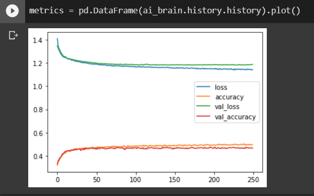
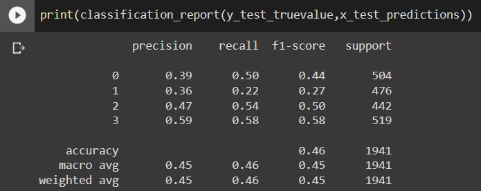
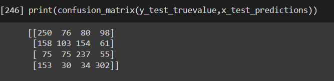
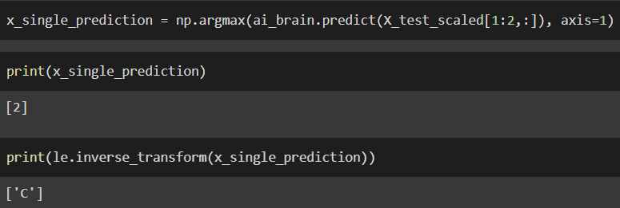

# Developing a Neural Network Classification Model

## AIM

To develop a neural network classification model for the given dataset.

## Problem Statement

An automobile company has plans to enter new markets with their existing products. After intensive market research, they’ve decided that the behavior of the new market is similar to their existing market.

In their existing market, the sales team has classified all customers into 4 segments (A, B, C, D ). Then, they performed segmented outreach and communication for a different segment of customers. This strategy has work exceptionally well for them. They plan to use the same strategy for the new markets.

You are required to help the manager to predict the right group of the new customers.


## DESIGN STEPS

### STEP 1:
Load the csv file and then use the preprocessing steps to clean the data
### STEP 2:
Split the data to training and testing
### STEP 3:
Train the data and then predict using Tensorflow

## PROGRAM
```
Developed By: Praveen D
Register Number: 212222240076
```
```
import pandas as pd
from sklearn.model_selection import train_test_split
from tensorflow.keras.models import Sequential
from tensorflow.keras.models import load_model
import pickle
from tensorflow.keras.layers import Dense
from tensorflow.keras.layers import Dropout
from tensorflow.keras.layers import BatchNormalization
import tensorflow as tf
import seaborn as sns
from tensorflow.keras.callbacks import EarlyStopping
from sklearn.preprocessing import MinMaxScaler
from sklearn.preprocessing import LabelEncoder
from sklearn.preprocessing import OneHotEncoder
from sklearn.preprocessing import OrdinalEncoder
from sklearn.metrics import classification_report,confusion_matrix
import numpy as np
import matplotlib.pylab as plt

df = pd.read_csv('customers.csv')

df.columns

df.dtypes

df.shape

df.isnull().sum()

df_cleaned = df.dropna(axis=0)
df_cleaned.isnull().sum()

df_cleaned.shape

df_cleaned.dtypes

df_cleaned['Gender'].unique()

df_cleaned['Ever_Married'].unique()

df_cleaned['Profession'].unique()

df_cleaned['Spending_Score'].unique()

df_cleaned['Var_1'].unique()

df_cleaned['Segmentation'].unique()

categories_list=[['Male', 'Female'],['No', 'Yes'],['No', 'Yes'],['Healthcare', 'Engineer', 'Lawyer', 'Artist', 'Doctor','Homemaker'Entertainment,'Marketing', 'Executive'],['Low', 'Average,'High']
           ]
enc = OrdinalEncoder(categories=categories_list)

customer_1 = df_cleaned.copy()
customer_1[['Gender','Ever_Married','Graduated','Profession','Spending_Score']] = enc.fit_transform(customer_1[['Gender','Ever_Married','Graduated','Profession','Spending_Score']])

customer_1.dtypes

le = LabelEncoder()

customer_1['Segmentation'] = le.fit_transform(customer_1['Segmentation'])

customer_1 = customer_1.drop('ID',axis=1)
customer_1 = customer_1.drop('Var_1',axis=1)

customer_1.dtypes

coor = customer_1.corr()

corr = customer_1.corr()

sns.heatmap(corr,xticklabels=corr.columns,yticklabels=corr.columns,cmap="BuPu",annot= True)

sns.pairplot(customer_1)


sns.distplot(customer_1['Age'])


plt.figure(figsize=(5,3))
sns.countplot(customer_1['Family_Size'])

customer_1.describe()

customer_1['Segmentation'].unique()

X=customer_1[['Gender','Ever_Married','Age','Graduated','Profession','Work_Experience','Spending_Score','Family_Size']].values

y1 = customer_1[['Segmentation']].values

one_hot_enc = OneHotEncoder()

one_hot_enc.fit(y1)

y1.shape

y=one_hot_enc.transform(y1).toarray()

X_train,X_test,y_train,y_test=train_test_split(X,y,test_size=0.22,random_state=50)

scaler_age = MinMaxScaler()
scaler_age.fit(X_train[:,2].reshape(-1,1))

X_train_scaled = np.copy(X_train)
X_test_scaled = np.copy(X_test)

X_train_scaled[:,2] = scaler_age.transform(X_train[:,2].reshape(-1,1)).reshape(-1)
X_test_scaled[:,2] = scaler_age.transform(X_test[:,2].reshape(-1,1)).reshape(-1)

from sklearn.utils.extmath import softmax
from tensorflow import keras
ai_brain = keras.Sequential([
    Dense(6,input_shape = (8,) ),
    Dense(64,activation="relu"),
    Dropout(rate=0.3),
    Dense(128,activation="relu"),
    Dropout(rate=0.3),
    #BatchNormalization(),
    Dense(32,activation="relu"),
    Dense(4,activation='softmax')
])

ai_brain.compile(optimizer='adam',loss='categorical_crossentropy',metrics=['accuracy'])

early_stop = EarlyStopping(monitor='val_loss', patience=250)

ai_brain.fit(x=X_train_scaled,y=y_train,epochs=250,batch_size=256,validation_data=(X_test_scaled,y_test),callbacks=early_stop)

metrics = pd.DataFrame(ai_brain.history.history)

metrics.head()

metrics[['accuracy','val_accuracy']].plot()

metrics[['loss','val_loss']].plot()

x_test_predictions = np.argmax(ai_brain.predict(X_test_scaled), axis=1)

x_test_predictions.shape

y_test_truevalue = np.argmax(y_test,axis=1)

y_test_truevalue.shape

print(confusion_matrix(y_test_truevalue,x_test_predictions))

print(classification_report(y_test_truevalue,x_test_predictions))

x_single_prediction = np.argmax(ai_brain.predict(X_test_scaled[1:2,:]), axis=1)

print(x_single_prediction)

print(le.inverse_transform(x_single_prediction))
```
## OUTPUT

### Training Loss, Validation Loss Vs Iteration Plot


### Classification Report

### Confusion Matrix

### New Sample Data Prediction

## RESULT

Thus a Neural Network Classification Model is developed and executed successfully

